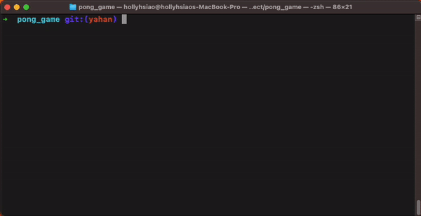
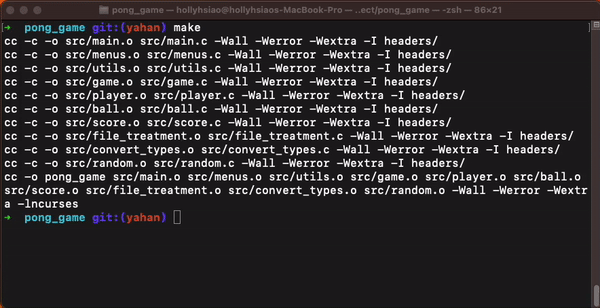

# Pong_game
This is a pong-like game coded in C. The developers are : [Ezagof](https://github.com/Ezagof) and [Yahan Hsiao](https://github.com/hollyhsiaohaha)

# Features 
The programme runs entirely in the terminal. The only game mode available is the
duel between two players (1v1), with both players able to move their racket with
the Q-A and O-L keys. The game counts the number of ball returns in each rally and
saves the best score with the date it was realized. During a match, each ball
return in a rally increases the ball speed until someone fails to return it.

# Personal goals
This project is important to us because it's the first time we've had to display
the rendering of a process repeated at a certain rate (Frames Per Second). We'll
also be learning how to detect keyboard inputs, as we are really interested in the
video-games development. Finally, this game is a video game icon, as it was one of
the must-have arcade games, so we had to remake this classic.

# Limits of the project
Development is scheduled to finish on 6 August at 11.42pm (GMT +8, Taiwan),
precisely at this time to honour our usual schedule (42's thing).
The allowed libraries are those : fcntl.h (open, close), unistd.h (write, read),
stdlib.h (malloc, free), the time.h library and ncurses.h (everything we need to
handle the keyboard inputs).

# How to play

## Compilation

The Makefile will compile the program with the following command :

```make```



## Execution

To play the game, you just have to run the following command :

```./pong_game```

